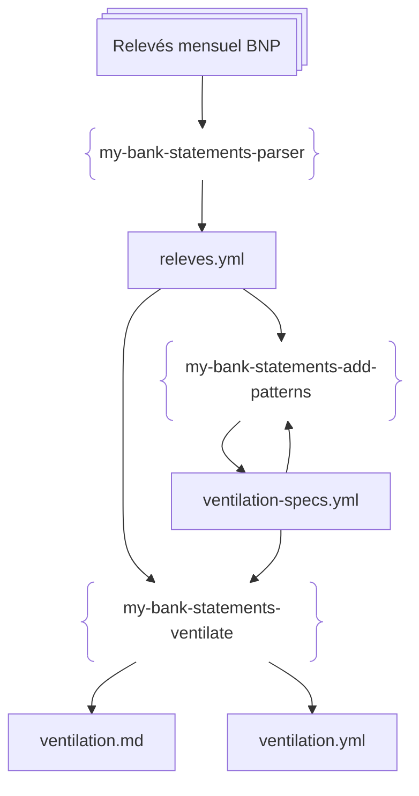
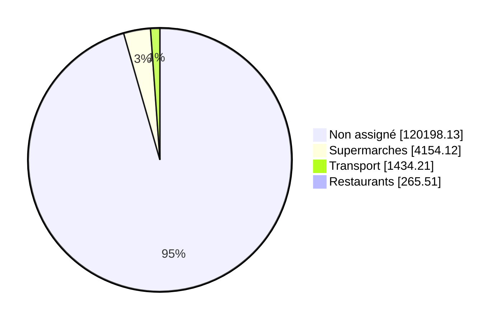

# my-bank-statements

[](https://github.com/laurentcarrie/my-bank-statements/actions/workflows/ci.yml)

A Rust library and CLI tools to parse bank statements (PDF) and categorize operations.

Currently supports **BNP Paribas** statements.

## Installation

From source:

```bash
cargo install --path .
```

## Workflow 



- releves : the pdf bank statement you get each month, with all your debits and credits
- releves.yml : a yml file, that contains all the operations of all the releves
- ventilation-specs.yml : a specification file on how to ventilate.
- ventilation.yml and ventilation.md : the outputs of the ventilation


## CLI Tools

### my-bank-statements-parser

Parses PDF bank statements and outputs YAML.

```bash
my-bank-statements-parser <pdf_file_or_directory>
```

- **Single file**: Parses the PDF and outputs `<filename>.yml`
- **Directory**: Parses all PDFs in the directory and outputs `releves.yml` with all releves sorted by date

#### Examples

```bash
$ my-bank-statements-parser statement.pdf
Parsed 42 operations (date: 2025-02-13) -> statement.yml

$ my-bank-statements-parser pdfs/
Parsed 104 operations (date: 2024-01-13) from statement1.pdf
Parsed 89 operations (date: 2024-02-13) from statement2.pdf
Wrote 2 releves to pdfs/releves.yml
```

### my-bank-statements-ventilate

Categorizes operations based on a ventilation spec and outputs results.

```bash
my-bank-statements-ventilate <releves.yml> <ventilation_spec.yml> [output.yml]
```

#### Example

```bash
$ my-bank-statements-ventilate pdfs/releves.yml ventilation_spec.yml
Wrote ventilation to ventilation.yml
Wrote ventilation.md
```

#### Ventilation Spec Format

```yaml
name: Budget Categories
assignments:
- name: Restaurants
  patterns:
  - RESTAURANT
  - BRASSERIE
  - CAFE
- name: Transport
  patterns:
  - RATP
  - SNCF
  - UBER
- name: Supermarches
  patterns:
  - CARREFOUR
  - MONOPRIX
  - FRANPRIX
- name: Impots
  ignore: true  # Excluded from pie chart
  patterns:
  - DGFIP IMPOT
```

The `ignore` field (default: `false`) allows you to exclude a category from the pie chart while still tracking it in the YAML output.

#### Output

The tool generates:
- `ventilation.yml`: YAML with categorized amounts
- `ventilation.md`: Markdown with a Mermaid pie chart (categories sorted by amount, descending)

Example `ventilation.md`:



### my-bank-statements-add-patterns

Interactive tool to help categorize unassigned operations by adding patterns to the ventilation spec.

```bash
my-bank-statements-add-patterns <releves.yml> <ventilation_spec.yml> [output.yml]
```

#### Features

- **Keyword suggestions**: Automatically suggests categories based on common keywords (restaurants, supermarkets, transport, etc.)
- **Pattern extraction**: Proposes clean patterns from operation descriptions
- **Auto-accept mode**: Press `a` to automatically accept all suggestions

#### Interactive Controls

- **Enter**: Accept the suggested category and pattern
- **0**: Skip this operation
- **a**: Enable auto-accept mode for all remaining suggestions
- **q**: Quit and save changes
- **1-N**: Choose a specific category by number
- **n**: Create a new category

#### Example

```bash
$ my-bank-statements-add-patterns pdfs/releves.yml ventilation_spec.yml
Found 45 unassigned operations.
Processing 32 unique operation descriptions...

----------------------------------------
Operation: FACTURE(S) CARTE ... CARREFOUR MARKET
Amount: -42.50 EUR
Date: 2025-01-15

>>> Suggested: Supermarches (pattern: CARREFOUR MARKET)

Actions:
  [Enter] Accept suggestion (if any)
  0. Skip
  a. Auto-accept all suggestions
  q. Quit (save changes)
  1. Restaurants
  2. Supermarches
  ...

Choice:
```

## Output Format

All monetary amounts are stored as integers representing centimes (1€ = 100).

```yaml
- date_du_releve: 2025-02-13
  solde_ouverture:
    solde_type: Credit
    montant: 150000
  solde_cloture:
    solde_type: Credit
    montant: 200000
  total_des_operations_debit: 350000
  total_des_operations_credit: 400000
  check_debit: 350000
  check_credit: 400000
  operations:
  - date: 2025-01-16
    nature_des_operations: PRLV SEPA ...
    valeur: 2025-01-16
    montant: 10000
    montant_type: Debit
  - date: 2025-01-29
    nature_des_operations: VIR SEPA RECU ...
    valeur: 2025-01-29
    montant: 100000
    montant_type: Credit
```

The parser validates that `check_debit` equals `total_des_operations_debit` and `check_credit` equals `total_des_operations_credit`. If there's a mismatch, an error is reported.

## Library Usage

```rust
use my_bank_statements::{parse_pdf, SoldeType};

let releve = parse_pdf("statement.pdf")?;
println!("Date: {}", releve.date_du_releve);
for op in releve.operations {
    let sign = match op.montant_type {
        SoldeType::Credit => "+",
        SoldeType::Debit => "-",
    };
    // montant is in centimes
    println!("{}: {}{:.2}€", op.date, sign, op.montant as f64 / 100.0);
}
```

## Build

```bash
cargo build --release
```

## Tests

```bash
cargo test
```
